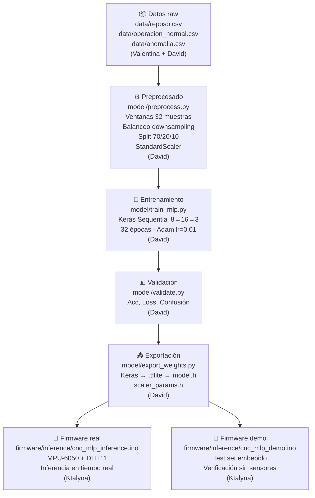
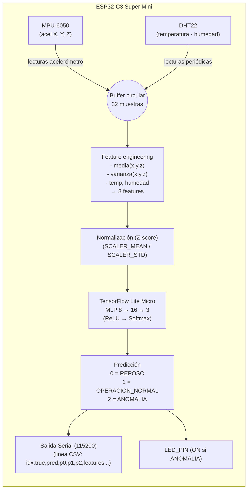
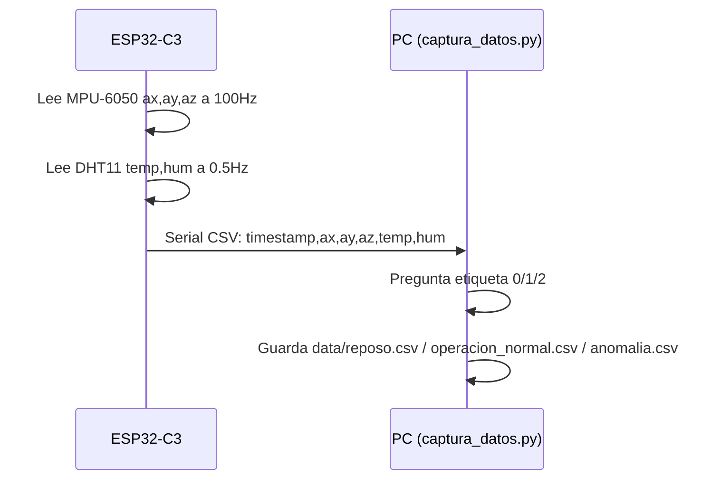
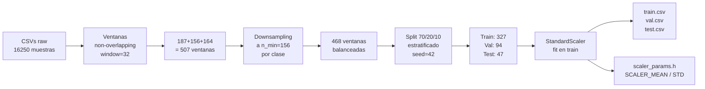
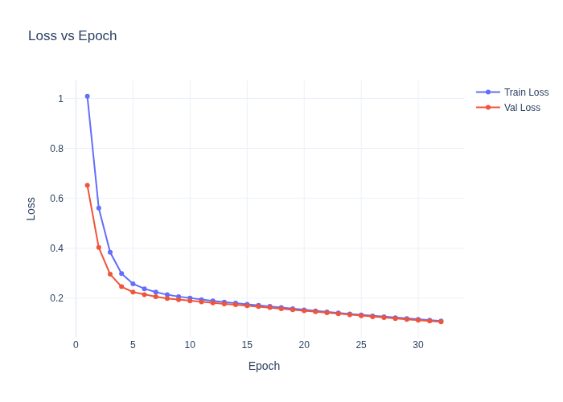
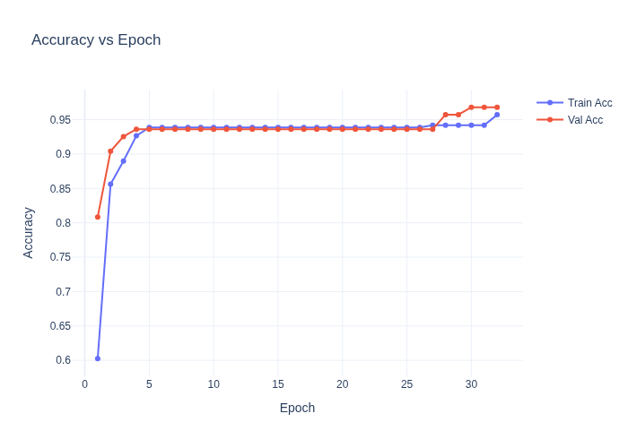
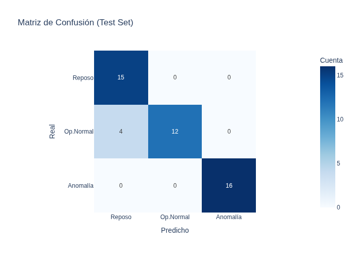
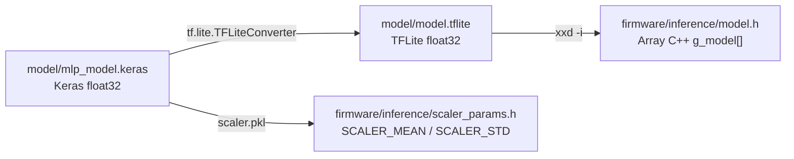

# CNC IoT — Clasificador de Estados Vibracionales · Edge AI

Proyecto de la **Especialización en Inteligencia Artificial aplicada a IoT**  
Universidad Autónoma de Occidente · Práctica 4 — MLP en ESP32 (TinyML / Edge AI)

---

## Integrantes

| Rol | Persona | Responsabilidad |
|-----|---------|-----------------|
| Hardware & Recolección | Valentina | ESP32-C3 + MPU-6050 + DHT11 · Firmware de captura de datos etiquetados |
| Entrenamiento MLP | David | Dataset CSV · Entrenamiento Keras/TF · Exportación a TF Lite |
| Firmware & Despliegue | Ktalyna | Inferencia TF Lite Micro en ESP32 · Firmware de demo sobre conjunto de test |

---

## Caso de uso

**FLUX** es una empresa de maquinado CNC. El objetivo es detectar automáticamente el estado de la máquina en tiempo real, **directamente en el ESP32**, sin necesidad de enviar datos a la nube:

| Clase | Estado | Descripción |
|-------|--------|-------------|
| 0 | 🟢 Reposo | Máquina apagada o en pausa |
| 1 | 🔵 Operación Normal | Maquinado dentro de parámetros normales |
| 2 | 🔴 Anomalía | Vibración excesiva — posible falla mecánica |

---

## ¿Por qué Edge AI?

En las prácticas anteriores el ESP32 enviaba datos a la nube (Azure IoT Hub / Mosquitto) y el procesamiento ocurría en servidores remotos. En este proyecto la **inferencia ocurre directamente en el microcontrolador**:

```
Antes (Cloud AI):     ESP32 → Internet → Azure → Predicción → ESP32
Ahora (Edge AI):      ESP32 → Predicción local en < 1ms → Acción inmediata
```

**Ventajas para la CNC FLUX:**
- ⚡ Latencia < 1ms — reacción inmediata ante anomalías
- 🔌 Funciona sin internet — no depende de conectividad
- 🔒 Privacidad — los datos de vibración no salen de la máquina
- 💰 Costo cero en cómputo cloud

---

## Pipeline completo (extremo a extremo)



---

## Arquitectura del sistema



---

## 1. Recolección de datos (Valentina)

El firmware `cnc_iot_esp32.ino` transmite lecturas del MPU-6050 y DHT11 por Serial a ~100 Hz.  
El script `captura_datos.py` las recibe y las guarda en CSV etiquetados listos para el entrenamiento.

### Flujo de recolección



### Instrucciones rápidas

**1. Subir firmware de captura**
```
Arduino IDE → Abrir Esp32/cnc_iot_esp32/cnc_iot_esp32.ino
Placa: ESP32C3 Dev Module
Compilar y cargar
```

**2. Instalar dependencias Python**
```bash
pip install pyserial
```

**3. Capturar datos**
```bash
python Esp32/captura_datos.py
```

El script detecta el puerto automáticamente, pregunta qué clase capturar y muestra una barra de progreso.

| Clase | Estado | Cómo simularlo |
|-------|--------|----------------|
| 0 | Reposo | ESP32 quieto, máquina apagada |
| 1 | Operación Normal | ESP32 sobre máquina en funcionamiento normal |
| 2 | Anomalía | Golpear/sacudir el ESP32 fuertemente |

Formato del CSV generado:
```
timestamp_ms,accel_x,accel_y,accel_z,temperatura,humedad,label
1234567890,0.1200,-0.0300,9.8100,27.40,62.10,0
```

### Datos recolectados

| Clase | Muestras raw |
|-------|-------------|
| 0 Reposo | 6 000 |
| 1 Operación Normal | 5 000 |
| 2 Anomalía | 5 250 |
| **Total** | **16 250** |

---

## 2. Preprocesado (David)

Script: `model/preprocess.py`

### Diagrama de preprocesado



### Features del modelo (8 entradas)

Sobre una **ventana deslizante de 32 muestras** (~320 ms a 100 Hz):

| # | Feature | Cálculo |
|---|---------|---------|
| 0 | media(accel_x) | Promedio del eje X |
| 1 | varianza(accel_x) | Varianza del eje X |
| 2 | media(accel_y) | Promedio del eje Y |
| 3 | varianza(accel_y) | Varianza del eje Y |
| 4 | media(accel_z) | Promedio del eje Z |
| 5 | varianza(accel_z) | Varianza del eje Z |
| 6 | temperatura | Valor directo DHT11 (°C) |
| 7 | humedad | Valor directo DHT11 (%) |

> La temperatura y humedad se usan como valor directo porque el DHT11 mide lento (cada 2 s) — calcular varianza no aporta información útil para detección de vibración.

### Ejecutar preprocesado

```bash
make preprocess
# O directamente:
python model/preprocess.py
# → Genera: model/train.csv, model/val.csv, model/test.csv
# → Genera: model/scaler.pkl
# → Genera: firmware/inference/scaler_params.h
```

---

## 3. Entrenamiento del modelo (David)

Script: `model/train_mlp.py`

### Arquitectura MLP

| Capa | Tipo | Unidades | Activación |
|------|------|----------|-----------|
| Entrada | Dense | 8 | — |
| Oculta | Dense | 16 | ReLU |
| Salida | Dense | 3 | Softmax |

- Épocas: **32** · Batch: **32** · Optimizador: **Adam(lr=0.01)** · Seed: **42**
- Función de pérdida: `sparse_categorical_crossentropy`
- Balanceo: downsampling a n_min=156 ventanas por clase

### Curvas de entrenamiento

Las gráficas interactivas se encuentran en `model/figures/`:

| Figura | Descripción |
|--------|-------------|
| [`model/figures/loss_curve.html`](model/figures/loss_curve.html) | Pérdida de entrenamiento y validación por época |
| [`model/figures/accuracy_curve.html`](model/figures/accuracy_curve.html) | Accuracy de entrenamiento y validación por época |
| [`model/figures/confusion_matrix.html`](model/figures/confusion_matrix.html) | Matriz de confusión sobre el conjunto de test |

Versiones estáticas PNG:

| Figura | Vista previa |
|--------|-------------|
| Curva de pérdida |  |
| Curva de accuracy |  |
| Matriz de confusión |  |

### Resultados finales (seed=42, 32 épocas)

| Métrica | Valor |
|---------|-------|
| Train accuracy (época 32) | **95.7%** |
| Val accuracy (época 32) | **96.8%** |
| **Test accuracy (Keras)** | **91.5%** |
| **Test accuracy (TFLite)** | **91.5%** |
| Diferencia máx. probabilidades Keras vs TFLite | 2.2 × 10⁻⁷ |

### Matriz de confusión (test set, 47 muestras)

```
                precision  recall  f1-score  support
Reposo              0.79    1.00      0.88       15
Op. Normal          1.00    0.75      0.86       16
Anomalía            1.00    1.00      1.00       16

accuracy                              0.91       47
```

> 4 instancias de Operación Normal fueron clasificadas como Reposo (falsos negativos de clase 1).  
> La Anomalía se detecta con precisión y recall perfectos (1.00 / 1.00).

### Ejecutar entrenamiento

```bash
make train
# O directamente:
python model/train_mlp.py
# → Genera: model/mlp_model.keras
# → Genera: model/training_history.json
```

---

## 4. Validación (David)

Script: `model/validate.py`

```bash
make validate
# O directamente:
python model/validate.py
# → Genera: model/report.txt
# → Genera: model/figures/loss_curve.{html,png}
# → Genera: model/figures/accuracy_curve.{html,png}
# → Genera: model/figures/confusion_matrix.{html,png}
```

El reporte completo se encuentra en [`model/report.txt`](model/report.txt).

---

## 5. Exportación del modelo (David)

Script: `model/export_weights.py`

### Flujo de exportación



```bash
make export
# O directamente:
python model/export_weights.py
# → Genera: model/model.tflite      (2504 bytes)
# → Genera: firmware/inference/model.h
# → Genera: firmware/inference/scaler_params.h
```

---

## 6. Inferencia en ESP32 (Ktalyna)

Hay dos firmwares en `firmware/inference/`:

| Firmware | Descripción |
|----------|-------------|
| `cnc_mlp_inference.ino` | **Producción**: usa MPU-6050 + DHT11 en tiempo real |
| `cnc_mlp_demo.ino` | **Demo/Test**: usa `test_data.h` embebido, sin sensores físicos |

### 6a. Firmware de producción — `cnc_mlp_inference.ino`

Requiere ESP32-C3 con MPU-6050 (SDA=GPIO8, SCL=GPIO9) y DHT11 (GPIO0) conectados.

```
1. Abrir Arduino IDE
2. Instalar librería: TFLite_ESP32 by Eloquent Arduino
3. Abrir firmware/inference/cnc_mlp_inference.ino
4. Verificar que model.h y scaler_params.h están en el mismo directorio
5. Seleccionar placa: ESP32C3 Dev Module
6. Compilar y cargar
7. Abrir Serial Monitor a 115200 baud
```

Salida esperada:
```
=== FLUX CNC IoT - Edge AI Inference ===
[TFLite] Modelo cargado correctamente.
[TFLite] Tensores asignados.
MPU-6050 OK (±2g)
=== Sistema Listo para Inferencia ===
──────────────────────────────
Temp: 27.40 C  Hum: 62.10%
Media   X:0.012 Y:-0.003 Z:9.810
Varianza X:0.0001 Y:0.0001 Z:0.0002
Prediccion: [1] OPERACION_NORMAL
Probs: R=0.02 ON=0.95 AN=0.03
```

### 6b. Firmware de demostración — `cnc_mlp_demo.ino`

Ejecuta la MLP sobre el conjunto de test del repositorio (`model/test.csv`) **sin necesidad de sensores físicos**. Ideal para verificar que el modelo produce las predicciones correctas en el dispositivo objetivo.

```
1. Abrir Arduino IDE
2. Instalar librería: TFLite_ESP32 by Eloquent Arduino
3. Abrir firmware/inference/cnc_mlp_demo.ino
4. Verificar que model.h, scaler_params.h y test_data.h están en el mismo directorio
5. Seleccionar placa: ESP32C3 Dev Module
6. Compilar y cargar
7. Abrir Serial Monitor a 115200 baud
```

Salida esperada:
```
=== FLUX CNC · Demo MLP sobre conjunto de test ===
Muestras en TEST_DATA : 47
DEMO_USE_SCALED_DATA  : true (sin normalize)
Delay entre muestras  : 500 ms

[TFLite] Modelo cargado desde model.h
[TFLite] Arena usada: XXXX bytes
[OK] Sistema listo. Iniciando inferencia sobre TEST_DATA...

[  0] true=REPOSO           pred=REPOSO           OK   | P(R)=0.998 P(ON)=0.001 P(AN)=0.001 | feat: ...
[  1] true=ANOMALIA         pred=ANOMALIA          OK   | P(R)=0.001 P(ON)=0.002 P(AN)=0.997 | feat: ...
...

========================================
  FIN DEL CONJUNTO DE TEST
  Aciertos: 43 / 47  (91.5%)
========================================
Reiniciando en 10 s...
```

#### Macro `DEMO_USE_SCALED_DATA`

| Valor | Comportamiento |
|-------|---------------|
| `true` (por defecto) | `TEST_DATA` ya contiene features escaladas (como en `model/test.csv`) → **no** se aplica `normalize_features()` |
| `false` | `TEST_DATA` contiene valores raw → **sí** se aplica `normalize_features()` con `SCALER_MEAN`/`SCALER_STD` |

Para compilar con datos raw, agregar antes del primer `#include`:
```cpp
#define DEMO_USE_SCALED_DATA false
```

#### `test_data.h` — Cómo regenerarlo

```bash
# Desde la raíz del repositorio:
python3 - <<'EOF'
import csv, datetime
rows = list(csv.DictReader(open("model/test.csv")))
N = len(rows)
feat_cols = ["mean_x","var_x","mean_y","var_y","mean_z","var_z","temperature","humidity"]
with open("firmware/inference/test_data.h","w") as out:
    out.write("// Generado desde model/test.csv\n#pragma once\n")
    out.write(f"const int TEST_N = {N};\n")
    out.write(f"const float TEST_DATA[{N}][8] = {{\n")
    for i,r in enumerate(rows):
        vals = ", ".join(f"{float(r[c]):.8f}f" for c in feat_cols)
        out.write(f"  {{ {vals} }}{',' if i<N-1 else ''}\n")
    out.write("};\n")
    out.write(f"const int TEST_LABEL[{N}] = {{ {','.join(r['label'] for r in rows)} }};\n")
print(f"test_data.h: {N} muestras")
EOF
```

---

## Hardware

| Componente | Conexión | Función |
|------------|----------|---------|
| ESP32-C3 Super Mini | — | Microcontrolador. Corre la inferencia TF Lite Micro en tiempo real |
| MPU-6050 | SDA=GPIO8, SCL=GPIO9 | Acelerómetro I²C. Mide vibración X, Y, Z a ~100 Hz |
| DHT11 | GPIO0 | Sensor temperatura (°C) y humedad (%) |
| LED (indicador) | GPIO10 | Se enciende cuando se detecta Anomalía (clase 2) |

⚠️ GPIO21 dañado — no usar.

---

## Estructura del repositorio

```
cnc-iot-ia/
├── Esp32/
│   ├── captura_datos.py                  # Script Python: guarda CSV etiquetados desde Serial (Valentina)
│   └── cnc_iot_esp32/
│       ├── cnc_iot_esp32.ino             # Firmware captura: MPU-6050 + DHT11 → Serial CSV (Valentina)
│       └── credentials.h                 # WiFi (NO subir credenciales reales)
├── firmware/
│   └── inference/
│       ├── cnc_mlp_inference.ino         # Firmware producción: inferencia en tiempo real (Ktalyna)
│       ├── cnc_mlp_demo.ino              # Firmware demo: inferencia sobre test_data.h (Ktalyna)
│       ├── test_data.h                   # Conjunto de test embebido (47 muestras escaladas)
│       ├── model.h                       # Modelo TFLite como array C++ (generado por David)
│       └── scaler_params.h               # Parámetros normalización Z-score (generado por David)
├── data/
│   ├── reposo.csv                        # Dataset clase 0 (Valentina + David)
│   ├── operacion_normal.csv              # Dataset clase 1 (Valentina + David)
│   └── anomalia.csv                      # Dataset clase 2 (Valentina + David)
├── model/
│   ├── preprocess.py                     # Feature engineering + scaler + splits (David)
│   ├── train_mlp.py                      # Entrenamiento Keras MLP (David)
│   ├── validate.py                       # Métricas + gráficas (David)
│   ├── export_weights.py                 # Keras → TFLite → model.h + scaler_params.h (David)
│   ├── dataset_balanced.csv              # Dataset balanceado (468 ventanas)
│   ├── train.csv / val.csv / test.csv    # Splits escalados
│   ├── mlp_model.keras                   # Modelo Keras (mejor val_loss)
│   ├── model.tflite                      # Modelo exportado TFLite float32
│   ├── scaler.pkl                        # StandardScaler serializado
│   ├── training_history.json             # Historial de entrenamiento
│   ├── report.txt                        # Métricas y validación
│   └── figures/                          # Gráficas Plotly (HTML + PNG)
│       ├── loss_curve.{html,png}
│       ├── accuracy_curve.{html,png}
│       └── confusion_matrix.{html,png}
└── README.md
```

---

## Pipeline completo con Make

```bash
# Crear entorno virtual e instalar dependencias
make env

# Ejecutar todo el pipeline
make all

# O paso a paso:
make count       # → model/data_counts.json
make preprocess  # → train/val/test.csv · scaler.pkl · scaler_params.h
make train       # → mlp_model.keras · training_history.json
make export      # → model.tflite · model.h
make validate    # → report.txt · figures/
```

---

## Dependencias

### Arduino IDE

| Librería | Fuente |
|----------|--------|
| **TFLite_ESP32** by Eloquent Arduino | Library Manager |
| **DHT sensor library** by Adafruit | Library Manager (firmware de captura y producción) |
| **Wire** | Incluida en ESP32 core |

> El firmware de demo `cnc_mlp_demo.ino` **NO requiere** DHT ni Wire.

### Python (pipeline de entrenamiento)

```bash
pip install tensorflow scikit-learn numpy pandas plotly joblib kaleido pyserial
```

---

## Comparación con entregas anteriores

| Aspecto | Entrega 2 (MQTT+InfluxDB) | Entrega 3 (Azure IoT) | Esta entrega (Edge AI) |
|---------|--------------------------|----------------------|------------------------|
| Dónde procesa | Servidor (nube) | Azure Functions | ESP32 (edge) |
| Latencia | ~100 ms+ | ~500 ms+ | < 1 ms |
| Requiere internet | Sí | Sí | No |
| Tipo de análisis | Umbrales fijos | Umbrales fijos | Red neuronal MLP |
| Framework ML | — | — | TF Lite Micro |

---

## Criterios de evaluación

| Criterio | Cómo verificarlo |
|----------|-----------------|
| ✅ Dataset etiquetado | Archivos CSV en `data/` con 16 250 muestras raw |
| ✅ Modelo entrenado | `model/mlp_model.keras` + gráficas en `model/figures/` |
| ✅ Exportación TF Lite | `model/model.tflite` + `firmware/inference/model.h` |
| ✅ Inferencia en ESP32 | `cnc_mlp_inference.ino` — Serial Monitor en tiempo real |
| ✅ Verificación offline | `cnc_mlp_demo.ino` — 91.5% accuracy sobre test set embebido |
| ✅ README con pipeline | Este documento con diagramas Mermaid y gráficas |
